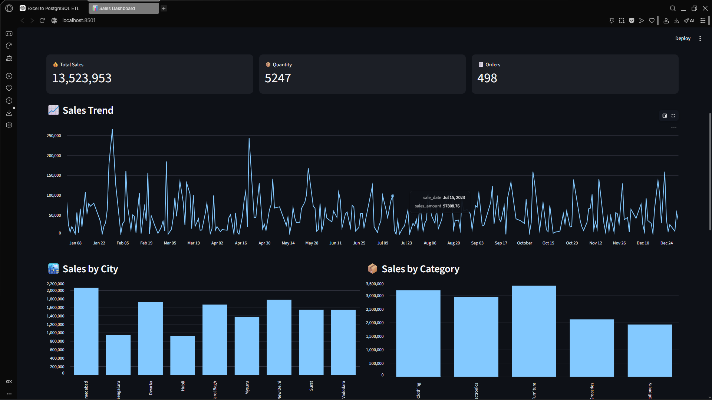

# 📊 Sales Data Pipeline & Dashboard

## 🚀 Project Overview
This project is a complete **end-to-end data pipeline and dashboard system** built using Python.

It automatically:
- Detects new Excel files
- Cleans and transforms data using Pandas
- Stores data in PostgreSQL
- Displays insights in an interactive dashboard

---

## 🔄 Workflow

Excel File → Python Pipeline → PostgreSQL Database → Streamlit Dashboard

---

## ⚙️ Technologies Used

- Python
- Pandas
- PostgreSQL
- SQLAlchemy
- Streamlit
- Watchdog (file automation)

---

## 📌 Features

✅ Automatic file detection (no manual run needed)  
✅ Data cleaning and transformation  
✅ Excel date conversion handling  
✅ Duplicate prevention (UNIQUE constraint + ON CONFLICT)  
✅ Real-time dashboard  
✅ Filters (date, city, category)  
✅ KPI metrics (sales, quantity, orders)  
✅ Charts (trend, category, city, top products)  
✅ Export filtered data (CSV)  

---
## 📊 Dashboard Preview


---

## 🧠 Key Concepts Implemented

- ETL Pipeline (Extract, Transform, Load)
- Idempotent Data Processing (no duplicate inserts)
- Database Constraints
- Real-time Data Visualization

---

## 🗄️ Database Schema

```sql
CREATE TABLE store (
    sale_date DATE NOT NULL,
    customer_name VARCHAR(20) NOT NULL,
    city VARCHAR(20) NOT NULL,
    state_order VARCHAR(20) NOT NULL,
    region VARCHAR(10) NOT NULL,
    product_category VARCHAR(20) NOT NULL,
    product_name VARCHAR NOT NULL,
    quantity INT NOT NULL,
    price_per_unit DECIMAL(10,2),
    sales_amount DECIMAL(10,2)
);
```
## 📂 Project Structure
```
project/
│
├── src/
│   ├── main.py          # File watcher (pipeline trigger)
│   ├── processor.py     # Data cleaning & transformation
│   ├── db.py            # Database connection & insert
│   ├── config.py        # Config variables
│
├── dashboard/
│   └── app.py           # Streamlit dashboard
│
├── input_files/         # Drop Excel files here
├── processed_files/     # Successfully processed files
├── failed_files/        # Failed files
├── logs/                # Log files
├── screenshots/         # Dashboard images
│
└── README.md
```

## ▶️ How to Run
```
python src/main.py
python -m streamlit run dashboard/app.py
```
## 📥 How It Works
Drop Excel file into input_files/
Pipeline detects file automatically
Data is cleaned and validated
Data inserted into PostgreSQL
Dashboard updates automatically

## 🧪 Testing
Inserted 200 unique rows ✅
Inserted 300 duplicate rows ❌ (skipped automatically)
Verified correct data in database ✅
## 👤 Author
Hussain Ali
📧 Email: ha7803832gmail.com
📞 Phone: 03357897412 / 03318782469